## 项目说明
- 此项目为本人大学期间的编译原理课程设计
- 为PASCAL到C的编译器，本项目并不支持全部的PASCAL语法，只是其子集
- 词法分析使用lex
- 语法分析使用yacc
- 整体工程使用C++，采用cmake构建

## 项目构建方式
- 安装cmake
- 安装MinGW，将mingw32-make.exe复制改名为make.exe
- 在pascal2c-compiler/build目录下依次执行指令
    - cmake -G "MinGW Makefiles" ../src
    - make
    - make install
- 在pascal2c-compiler/build/out/目录下，执行pascal2c.exe
    - 得到CProgram.c文件，该文件是将pascal源代码PascalProgram.pas编译为C代码的结果

## 目录结构
- lex-yacc-src/
    - 本项目的词法分析和语法分析使用lex和yacc
    - 该目录为lex和yacc的源代码目录
    - lex和yacc编译后得到c代码，加入src目录
- src/
    - pascal2c编译器的源代码
- test-cases/
    - 各种测试用例

## pascal2c.exe的使用
| 参数接口 | 参数 | 参数功能 | 参数默认值
| --- | --- | --- | ---
| -inname | [file name] | 指定输入文件名 | PascalProgram.pas
| -outname | [file name] | 指定输出文件名 | CProgram.c
| -compiler | [compiler name] | 指定c编译器名,并将c程序编译成可执行文件 | gcc
| -exename | [exe name] | 指定可执行文件名，自动编译 | CProcess.exe
| -execute | 无 | 自动执行生成的可执行文件，如果未出现-e、-exename参数，则均按照默认方式进行操作 | 
| -errorbound | [n] | 指定错误上限，即编译器发现了指定个数的错误后，立即停止运行 | INF
| -developer | 无 | 输出开发者信息 | 
| -version | 无 | 输出版本信息 | 
| -help | 无 | 输出所有命令行参数的帮助信息 | 

注：中括号表示该参数可有可无
## 编译器功能模块图


## 主函数流程图


## 需求分析
### 整体需求分析
一个完整的编译器分成分析阶段和综合阶段。分析阶段由词法分析、语法分析、语义分析组成；综合阶段由中间代码生成、代码优化、代码生成组成。我们需要实现的是PASCAL_S到C的编译器，源语言和目标语言均为高级语言，因此应省略综合阶段的中间代码生成和代码优化这两部分，也就是说，综合阶段直接将分析阶段得到的输出转化为目标代码。另外，符号表的管理和访问、错误处理将贯穿整个编译过程。

下面的数据流图说明了每一部分的输入输出，及其相互之间的逻辑关系。


### 词法分析的需求分析
编译的整个过程从词法分析开始。从左至右逐个字符地对源程序进行扫描，按照源语言的词法规则识别出一个个单词符号，把识别出来的标识符存入符号表中，并产生用于语法分析的记号序列。另外，词法分析程序还可以完成用户接口有关的一些任务，如识别源程序中的注释和跳过空格，把来自编译程序的错误信息和源程序联系起来。在遇到错误时，为了使词法分析程序能够继续运行下去，还要对出现的错误进行适当的恢复。

词法分析的输入是用源语言编写的程序，输出是详细词法错误信息及记号序列。记号指的是某一类单词的类别编码，如常数的记号num，而单词指的是某一类单词符号中的一个实例，如标识符position就是一个单词。我们计划利用LEX进行词法分析。

LEX能够自动生成词法分析程序的前提就是我们能够提供所有单词的模式。一般来说，在输入符号串中有很多子串具有相同的记号输出，每个这样的子串都是一个单词，并且都可以用同一构成规则（即模式或者说正则表达式）描述。所以需要给出所有记号的正则表达式（描述记号的模式）的定义。为此，我们要根据提供的文法和语法图，以及相关文档，学习PASCAL_S，从中整理出各个不同种类的单词（包括常数、标识符、各种关键字等），然后再分析得到正则表达式。在分析过程中，可以利用正则文法、自动机等辅助分析。

LEX通过正则表达式的匹配，执行相应的动作。而我们需要输出记号序列。词法分析程序在识别出一个记号后，要把与之有关的信息作为它的属性保留下来，记号影响语法分析的决策，属性影响记号的翻译。如果每一个关键字、运算符或标点符号作为单独的一类，则记号所代表的单词是唯一的，所以属性域可以是空的。若记号所代表的单词不唯一，则需要给出属性。

LEX遵循最长匹配和优先匹配规则。值得注意的一些词法约定细节有：1）标识符长度受限；2）PASCAL不区分大小写，在分析中识别出一个单词，要马上将其所有字母转化为小写（字符常量、关键字除外）；3）PASCAL语言程序的注释规则是注释用一对花括号括起来，编译程序要能处理注释，并将注释以某种形式保存下来，以便代码生成部分能够在恰当的部分用C语言的形式恢复注释。

词法分析阶段的错误主要就是读到非法字符（不属于该语言的字符集的字符），通常的做法是跳过非法字符，继续进行词法分析，同时需要输出详细的词法错误列表（错误发生的行数等），以便程序员修改词法错误。

### 语法分析的需求分析
语法分析是编译过程的核心部分，语法分析程序的输入是词法分析程序在扫描字符串源程序的过程中识别并生成的记号序列，语法分析程序分析验证这个记号序列是不是符合该语言语法规则的一个程序，若是，则输出其语法树，若不是，则表明输入的记号序列中存在语法错误，需要报告错误的性质和位置。

语法分析需要输出一棵抽象语法树。

我们将借助YACC工具，以LALR（1）的自底向上分析方法进行语法分析。为此，我们需要学习PASCAL_S语言，从中抽象出其语法结构，以文法表示。

我们需要一层一层（从简单到复杂）的分析PASCAL_S的各种语法单位，为详细设计中的文法设计奠定基础。

PASCAL程序由三大部分组成：程序首部（head），说明部分（变量、常量、子过程、子函数的定义），语句部分（body，主程序，是一个复合语句块）。

#### 常量
const关键字用以说明接下来的定义语句都属于常量定义。常量定义需要指定初值，且不必指定类型。常量的初值可以由整数、浮点数、字符常量、别的常量标识符等指明，可以是一个可以由编译器计算出结果的常量表达式（这里我们将其简化，限定为只能是+、-等弹幕运算符加上一个常量标识符组成的最简单的常量表达式）。PASCAL-S的常量定义不包含类型，因此其类型需要编译器判断。

#### 变量的定义
var关键字用以说明接下来的定义语句都属于变量定义。变量定义必须指明类型，无需指定初值。变量也可以是一维或多维数组，数组的各维下标由表达式组成。

#### 类型
可以是最简单的基本类型：integer、real、boolean、char，也可以是由这些基本类型组成的数组。

#### 参数表
函数/过程的头部最重要的就是参数列表，参数列表由一系列的标识符、类型关键字组成的参数变量定义组成。PASCAL_S的参数有两种，引用和传值，语法上的区别在于是否包含var关键字。
	
#### 表达式
表达式是由一系列的操作符和操作数组成的，其定义一般是递归的，也就是说，操作数不止是“数”，也可以是一个表达式。我们从操作符优先级的角度进行了分层，使得表达式的语法结构更加清晰。

首先引入最底层的因子概念，因子包括：（1）一个常量；（2）一个变量；（3）由单目运算符not、-与另一因子组成的新的因子（这些单目运算符的优先级通常是最高的）；（4）括号括起来的表达式；（5）函数调用；

然后是项的概念，项可以是一个因子，也可以是由*、/、div、mod、and等优先级较高的双目运算符和两个因子组成的。

接下来是简单表达式的概念，简单表达式可以是一个项，也可以是由+、-、or等优先级较低的双目运算符和两个项组成。

最终是表达式的概念，表达式可以是一个简单表达式，可以是由>、=、<、<=、>=、<>等优先级最低的关系双目运算符和两个简单表达式组成。

#### 语句
语句除了函数（通常表现为赋值语句）、过程调用（过程调用单独作为一条语句，产生某种副作用）外，主要以顺序结构、分支结构、循环结构分成三类。

顺序结构是由begin和end关键字及其包括的递归定义的复合语句块。

分支结构我们只支持if条件语句，其结构如下：
<pre>
IF <条件>
THEN <语句1>
ELSE <语句2>

注：1、ELSE与最近的并且未被配对的ELSE配对；
2、 复合，如果THEN或ELSE带有多个语句，则要用BEGIN—END括起来；
</pre>

循环结构我们支持FOR语句、WHILE语句和REPEAT语句。

FOR语句的结构如下：
<pre>
FOR<循环变量>:=<初值> TO<终值> DO<语句> 
</pre>

WHILE语句与C语言中的WHILE语句基本一致，其结构如下：
<pre>
WHILE <条件> DO <语句>
</pre>

REPEAT语句则类似于C语言中的DO-WHILE语句，即至少会执行一次循环体，但是在条件测试上有所区别，REPEAT-UNTIL语句在UNTIL指明的条件为真时退出循环。其结构如下：
<pre>
REPEAT
<循环体>
UNTIL
<条件>分程序
</pre>
#### 子函数/过程
函数和过程的头部中都包括名称和参数表，此外函数头还需指明返回值的类型，然后是子函数/过程的主体。子函数/过程中不能再嵌套函数/过程，另外，常量定义、变量定义、复合语句块等都与主程序类似。

#### 分程序
分程序指的是PASCAL-S的主程序部分，首先要给出常量和变量的定义，然后是函数/过程的定义，最后是语句主体（begin和end包括的复合语句块）

#### 程序
程序由程序名称标识符、参数列表和分程序组成。这里的参数列表给出的参数标识符，通常用于命令行参数的指定。与子函数/过程不同的是，这里不指出标识符的类型。因此，如果程序主体中用到了该参数，就必须在变量定义区中再定义一次，指明具体类型。

语法分析和语义分析都可以用YACC进行，其中语法分析的侧重点在于错误处理和提示，以便为后续语义分析提供正确的语法结构（语法树）。接下来我们从语法分析的错误处理角度进行需求分析。

#### 错误处理
据统计，源程序中出现的错误多是语法错误，所以，编译时大多数错误的诊断和恢复工作集中在语法分析阶段。

语法分析程序进行错误处理的基本目标如下：
- 能够清楚而准确地报告发现的错误，如错误的位置和性质。
- 能够迅速地从错误中恢复过来，以便继续诊断后面可能存在的错误。
- 错误处理功能不应该明显地影响编译程序对正确程序的处理效率。

要完成目标（1），需要我们主观积累经验，收集可能的错误，如常见的算法表达式的括号不匹配、缺少运算对象等，并对症下药。其次，准确地识别到错误发生的位置后，应无误地将位置（错误代码行数）和性质输出。在我们采用的LALR(1)分析中，分析程序总是根据当前的栈顶状态和当前输入符号去查分析表，若找不到合法的动作，则意味着发现了一个语法错误。
实现目标（2）和（3），需要采用合理的错误恢复策略。例如小范围的短语级恢复，对于算法表达式的括号不匹配，可选择向前指针跳过当前符号，继续分析。结合利弊，对不同的错误进行分别处理和恢复。

#### 二义性消除
所有的二义性文法都不是LR文法。但PASCAL的某些结构用二义性文法描述比较直观且使用方便，例如if条件语句的直观描述产生式为`S->if E then S else S | if E then S | others`，根据PASCAL规定语法，需要在语法分析阶段增加“最近最后匹配原则”解决可能引发的冲突问题。
总之，在PASCAL语言中，有的文法表示可能是二义性的，但都说明了消除二义性的一些规则，以保证对每个句子的解释是唯一的，我们需要利用这些规则，确保语法分析不会受困于二义性的陷阱。

### 语义分析的需求分析
语义分析的输入是语法树，输出是注释分析树和语义错误信息（错误的性质和位置）和符号表，主要完成符号表的建立和操作、类型检查与转化、作用域识别等3个方面的内容。

#### 符号表的定义
主符号表要求记录：
- 种类标志
- 标识符名字
- 行号
- 类型
- 常量取值
- 参数个数/数组维数
- 数组各维上下界
- 指向函数/过程子符号表的指针

子符号表的表结构是主符号表的子集。由于不支持函数和过程的嵌套定义，所以子符号表相比于主符号表，少了函数/过程相关的域。子符号表要求记录：
- 种类标志
- 标识符名字
- 行号
- 类型
- 常量取值
- 数组维数
- 数组各维上下界

下面对符号表各域进行具体介绍。

**种类标志**：记录着标识符的符号种类。
- "value parameter"表示传值参数
- "var parameter"表示传引用参数
- "normal variant"表示普通变量
- "constant"表示常量
- "array"表示数组
- "procedure"表示过程
- "function"表示函数。

**标识符名字**：作为语义分析部分识别标识符的主键，在进行添加、查找、修改等操作时发挥重要作用。

**行号**：词法分析和语法分析时，在进行报错时可以很方便的获取出错的具体位置，但语义分析通常都是在更抽象的树结构上进行的，所以需要记录下每个符号的行号，以便报错包含位置信息。

**类型**：对于变量和常量来说，该域记录着变量或常量类型； 对于数组来说，该域记录着数组元素的类型；对于函数来说，该域记录着函数返回值类型。取值为”integer”、”real”、”char”、”boolean”。

**常量取值**：需要将常量的取值保存下来，以便后续计算常量表达式的值、进行常量定义时的常数传播、检查除0错误、检查数组下标越界。

**参数个数/数组维数**：在参数个数/数组维度部分，对于数组类型的变量，我们将存储其维数；对于函数类型，我们将存储其参数个数。

**数组各维上下界**：对于数组而言，在符号表中记录其各维上下界，便于判断其是否越界。

**指向函数/过程子符号表的指针**：在该指针域中保存该符号表中指向函数/过程子符号表的指针，便于进行定位和重定位处理。

#### 符号表的管理
定位操作：在每个程序块的入口处我们需要执行定位操作来建立一个符号表的子表，将该块的声明的所有标识符属性记录到该表中。

重定位操作：在每个程序块的出口处我们需要返回到主符号表，实现重定位操作，保证已经执行完的块中声明的局部变量不能再次被引用。

#### 类型检查与转化
我们的语义分析需要支持四种基本类型：integer、real、boolean、char，以及这四种基本类型声明的数组。

类型转化：我们仅支持隐式类型转化，且其中也仅支持从integer类型到real类型的隐式类型转化。需要特别注意的是，传引用参数不支持隐式类型转化。

表达式类型检查：每个运算符对于操作数的类型都有不同的要求，需要具体分析不同运算符的具体要求，例如mod运算符要求两个操作数均为”integer”类型，relop运算符要求两个操作数类型一致，或者符合隐式类型转化的规定。

语句类型检查：语句并没有“integer”、“real”、“char”、“boolean”这些类型。以if语句为例，如果其条件表达式的类型为“bool”，那我们认为该语句的类型正确，赋值为”void”，否则我们认为该语句的类型错误，赋值为“error”；再比如赋值语句就要求左值和右值的类型一致。不同的语句有不同的要求，需要具体分析。

#### 作用域识别
由于PASCAL-S不支持函数/过程的嵌套定义，所以作用域规则是十分简单的。

定义在PASCAL程序一开始的常量、变量就可以是视作是全局作用域，不仅可以被主程序体引用，也可以被子程序引用（如果子程序没有定义同名标识符）。

另外，每一个子函数/过程中定义的常量、变量的作用域就局限在当前函数/过程，属于局部作用域。

检测标识符未定义错误时，除了局部作用域（如果当前在局部作用域中），还需退回到全局作用域中。

检测标识符重定义错误时，只需要在局部作用域（如果当前在局部作用域中）中检查。

#### 代码生成需求分析
代码生成输入一般是注释分析树和信息较为完备的符号表，输出是目标代码。目标代码要求能在gcc编译器下正确编译，生成的可执行文件能够正确执行，在合法的输入下，得到正确的输出结果。

由于源语言和目标语言都是高级语言，所以我们直接生成目标代码，而不生成中间代码，否则会更加麻烦。借助经过了语义分析的抽象语法树和符号表，我们可以很轻松的进行目标代码生成。

接下来，我们从源语言的需求和目标语言的特点出发，通过对比来讨论代码生成的需求细节。

pascal主程序中的变量可以被所有的过程、函数体访问，具有全局作用域，因此对应于C语言中的全局变量。

pascal主程序头中包含了一个无类型的标识符列表。经查阅资料，这个标识符列表类似于c语言中main函数的参数列表，例如在命令行调用时可以指定这些参数。我们注意到在pascal的语法中，程序头对于这些标识符的声明没有类型的指示，而c语言有。这预示着在pascal中，我们仍需要定义这些标识符为具体的变量，才能使用，否则就属于未定义就引用的错误。input和output是两个特例，这两个标识符被隐含声明为程序参数且被隐含定义为文件变量，与标准输入，标准输出相关联。需要特别注意的是，程序标识符只能被定义为字符串、文件等类型，如果定义为其它类型，应忽略对应的参数（以避免一些类型错误，PASCAL编译器是这么做的），而我们并不考虑这些类型，所以我们暂时保留这个标识符列表，但在测试用例中并不涉及。如果后续我们有时间增加字符串等类型的支持再进行考虑。在PASCAL中使用命令行参数的一个较为方便的做法是利用paramcount和paramstr这两个变量，这与c语言中main函数的参数int argc, char **argv类似。但由于仍涉及字符串操作，我们仍不考虑。

对于常量定义，pascal中的const关键字作用域较大，不局限于下一个分号，而C语言中，每一分号隔出的部分都要单独使用一个const关键字。且pascal中的常量在定义时不需要指明类型，但是C语言需要。所以在我们需要在词法分析阶段完成对常量类型的自动识别，在目标代码生成时，指明对应的类型。

pascal在声明变量时，除了要说明类型，还要再前面加上var关键字，C语言中没有这样的关键字，只需要指明类型即可。var关键字的作用域与const关键字相同。

C语言中数组各维下标默认从0开始，而pascal中的范围可以任意指定，因此需要对数组下标进行相应的变换（在目标代码中需要新增定义临时变量以指明偏移量）。

PASCAL中函数返回值用 函数标识符:=表达式 表示，对应于C语言中的return语句。

PASCAL中如果函数或者过程没有参数，则无需包含空内容的括号，C语言中则需要。

PASCAL中多维数组的访问方法是在一个中括号内部，用逗号隔开各维索引，而C语言中则直接用中括号隔开各维索引。

C语言中一些基本的符号与PASCAL有所区别，例如C语言中的不等于用!=，而PASCAL中用<>。

PASCAL中的复合语句块用begin和end包括，而在C语言中用花括号包括。

代码生成的测试用例同整体测试，不再单独给出。

## 总体设计
语法分析调用词法分析得到记号序列，并分析生成抽象语法树。在抽象语法树上进行语义分析，建立和完善符号表，最后进行代码生成。

具体到开发细节，用LEX生成词法分析程序（C++），该词法分析程序由语法分析程序调用生成记号序列，用YACC生成语法分析程序（C++），该语法分析程序可以生成语法分析树，然后用C++编写程序将语法分析树转化为抽象语法树，作为语法分析的最终输出，然后用C++编写语义分析和代码生成程序，最后将各部分代码整合在一起，生成一个完整的编译器。
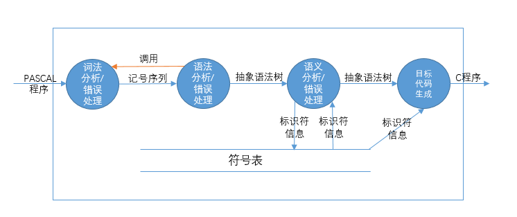

### 模块划分
#### 预处理
- 输入
    - PASCAL-S源程序文件
- 输出
    - 经过预处理的PASCAL-S程序文件
- 功能
    - PASCAL-S程序大小写不敏感，所以需要将所有字母转化为小写字母。
#### 词法分析
- 输入
    - 经过预处理的PASCAL-S程序文件
- 输出
    - 记号序列
- 功能
    - 编译的整个过程从词法分析开始。从左至右逐个字符地对源程序进行扫描，按照源语言的词法规则识别出一个个单词符号，产生用于语法分析的记号序列。识别源程序中的注释和跳过空格。在遇到错误时，为了使词法分析程序能够继续运行下去，还要对出现的词法错误进行报告，并进行适当的恢复。
#### 语法分析
- 输入
    - 记号序列
- 输出
    - 抽象语法树
- 功能
    - 语法分析程序的输入是词法分析程序在扫描字符串源程序的过程中识别并生成的记号序列，语法分析程序分析验证这个记号序列是不是符合该语言语法规则的一个程序，若是，则输出其语法分析树，并转化为抽象语法树，若不是，则表明输入的记号序列中存在语法错误，需要对语法错误进行适当的恢复，并报告错误的性质和位置。
#### 语义分析
- 输入
    - 抽象语法树
- 输出
    - 抽象语法树、符号表
- 功能
    - 遍历抽象语法树，完成符号表的建立和操作、类型检查与转化、作用域识别等3个方面的内容，需要报告语义错误的性质和错误。
#### 代码生成
- 输入
    - 抽象语法树、符号表
- 输出
    - C语言代码
- 功能
    - 遍历抽象语法树，并借助符号表的信息生成目标代码。

### 运行逻辑设计
编译器的运行设计主要针对错误的宏观处理，可以分为如下三种策略。
```
	（1）一旦发现任何一个错误，编译器立即终止运行。
	（2）编译器尝试从各种错误中恢复过来，并完成整个编译过程。
	（3）根据编译过程的模块划分，将错误恢复局限在一个模块中。即在任何一个模块中发现错误时，编译器将尝试从错误中恢复过来，并完成当前模块的处理，然后终止运行。

	采用策略（1）时，每运行一次编译器，编译程序只能报告一个错误，编译人员的工作效率将大打折扣。
	采用策略（2）时，极有可能出现错上加错的情况，导致后续的报错无法和源程序对应，给编译人员带来不必要的麻烦。
	采用策略（3）时，编译人员可以一次处理成批的错误，工作效率较高，且报错信息准确。
```
因此，采用策略（3）并根据源程序的错误情况，可以将编译器的运行情况表示为下表：
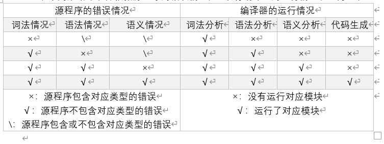
注：模块内部的接口设计、详细的错误处理方法，在详细设计中给出。
### 数据结构设计
#### 记号
不同的记号有不同种类的属性，直观的想法是设计一个结构体，用不同类型的域去表示不同类型的属性，但是在词法和语法分析阶段，这些记号的属性的存储形式不会产生任何影响，因此记号的结构体中，直接用string类型去表示各种记号的属性，其具体类型的转换工作由后续模块进行。
```c++
1.	class node  
2.	{  
3.	    string token;  
4.	    string value;  
5.	};  
```
其中，token表示的是记号或非终结符号的名称，value表示的是属性值。例如表达式的token域是”EXPRESSION”，value域为空；例如一个常数的123.456的token域是”NUMBER”, value域是”123.456”。

#### 语法分析树
由于YACC的限制，我们将扩展记号的结构体，作为语法分析树的节点结构体。
```c++
1.	class node  
2.	{  
3.	    string token;  
4.	    string value;  
5.	    vector<class node*> children;  
6.	};  
```

#### 抽象语法树
由于篇幅限制，树结构中仅画出最重要的信息，具体内容参照节点类的定义代码。该部分文档也可能和代码有所出入，具体以代码为准。
- 主程序(class _Program)
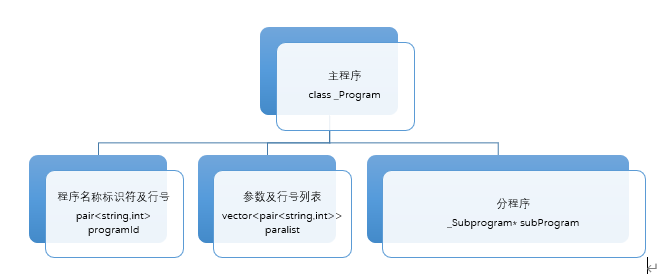
主程序由程序名称标识符、参数列表、分程序构成，分别对应如上图所示的数据结构
```c++
1.	class _Program{ //主程序体语法树数据结构定义    
2.	pair<string,int> programId;  //PASCAL程序名称标识符及行号 
3.	vector< pair<string,int> > paralist; //标识符名称及行号
4.	_Subprogram* subProgram;  //分程序  
5.	};  
```

- 分程序(class _Subprogram)
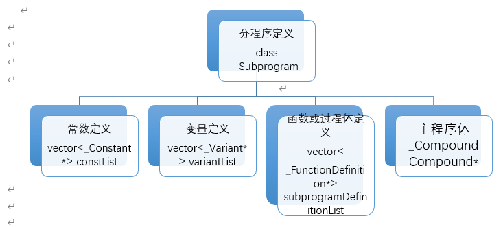
```c++
1.	class _Subprogram{ //分程序定义语法树的数据结构定义  
2.	vector<_Constant*> constList;  //常数定义列表
3.	vector<_Variant*> variantList; //变量定义列表
4.	vector<_FunctionDefinition*> subprogramDefinitionList;  //子程序和子函数
5.	_Compound* compound; //主程序体
6.	};  
```

- 常量定义(class _Constant)
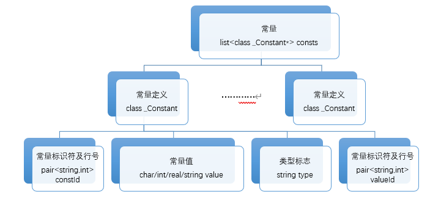
常量是不可再往下细化的语法单位，因此在语法树中附加行号信息，为错误处理机制提供方便（接下来所有原子级语法单位语法树都将附加行号变量）。常量也有可能由别的常量标识符提供取值，因此种类除了char、int、real之外，还设置了string，用于表明提供常量值的常量标识符的ID。常量标识符前面可能没有符号，也可能有加号，也可能有减号，其中加号和没有符号的等价，因此需要再加一个bool变量isMinusShow用于表示前面是否出现了减号。因此这里的value并不一定是常量的真实值，还需考虑isMinusShow的取值。
```c++
1.	list<class _Constant*> consts; //常量定义列表  
2.	class _Constant{  
3.	    pair<string,int> constId;  //常量标识符及行号 
4.	    string type; //int,char,real,string（这个string指的是常量标识符的ID）
5.	    pair<string,int> valueId;
6.	    char charValue;
7.	    int intValue;
8.	    float realValue;
9.	    string strOfVal;  //所有常量取值的字符串表示
10.	    bool isMinusShow; //是否出现减号
11.	}; 
```

- 类型(class _Type)
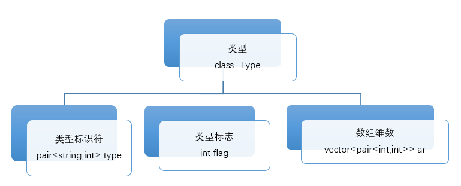
如上图所示的语法树主要分析integer, real, boolean, char和array类型，类型标志flag用于指示该类型是否为array，是的话则为1，同时数组下界与上界被赋予有意义的数值；否则为0，且low和high变量的值无效。数组可以多维，vector的大小即维数，每一个pair为数组的上下界。
```c++
1.	class _Type{  
2.	pair<string,int> type; //基本类型及行号，int、char、real、boolean 
3.	int flag; //若是array则flag=1，否则flag=0  
4.	vector<pair<int,int>> ar; //数组各维上下界
5.	};  
```

- 变量(class _Variant)
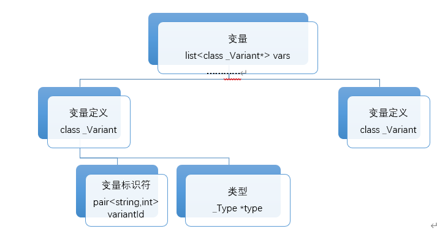
```c++
      1.	list<class _Variant*>vars; //变量列表  
      2.	class _Variant{  
      3.	pair<string,int> variantId;  //标识符及行号
      4.	_Type* type; //类型
      5.	};  
```

- 形式参数列表(class _FormalParameter)
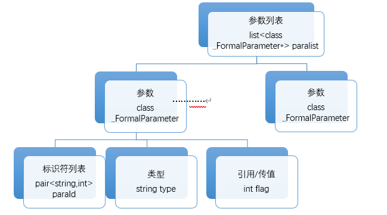
参数分为引用和传值调用两种，根据是否包含var关键字来区分。
```c++
      1.	list<class para*> paralist; //参数列表  
      2.	class _FormalParameter{  
      3.	pair<string,int> paraId;  //形式参数标识符和行号
      4.	string type; //形式参数类型，为基本类型
      5.	int flag; //flag=0代表传值调用，flag=1代表引用调用  
      6.	};  
```

- 函数/过程定义(class _FunctionDefinition)
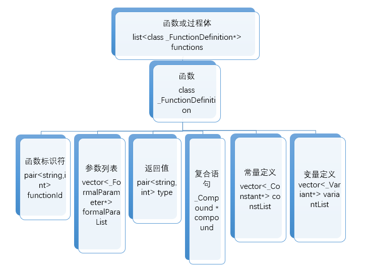
在这里我们把过程和函数统一成了一个结构体，可以通过返回值字符串是否为空来判断是函数还是过程。
```c++
1.	list<class class _FunctionDefinition*> functions//函数或过程体的列表  
2.	class _FunctionDefinition{//函数或过程体的语法树结构  
3.	pair<string,int> functionId;  //函数/过程标识符及行号
4.	vector<_FormalParameter*> formalParaList;  //形参列表
5.	pair<string,int> type; ///如果type.first是空串，则为过程，否则为函数,取值为"integer","real","boolean","char"四种
6.	vector<_Constant*> constList;  //常数定义列表
7.	vector<_Variant*> variantList; //变量定义列表
8.	_Compound* compound; //程序体
9.	};  
```

- 函数调用(class _FunctionCall)
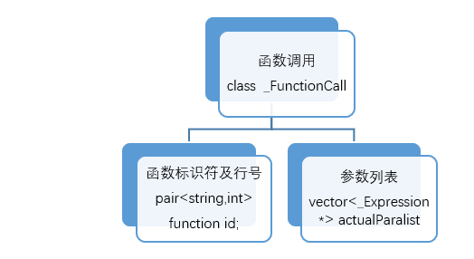
函数调用的参数列表是实际参数列表，与之前函数定义中的形式参数列表不同，这里的实际参数是一些表达式，因此加一个表达式结构体指针的线性表即可。
```c++
1.	class _FunctionCall{
2.	    string functionid; //函数标识符及行号
3.	    vector<_Expression*> actualParalist; //实参
4.	}
```

- 变量引用(class _VariantReference)
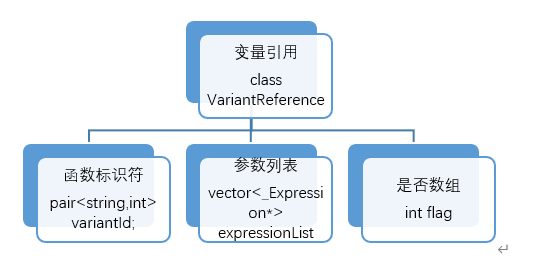
```c++
1.	class VariantReference{  
2.	    pair<string,int> variantId;//变量标识符和行号  
3.	    vector<_Expression*> expressionList;//各维的引用表达式  
4.	    int flag;//0表示非数组,1表示数组  
5.	}  
```

- 语句(class _Statement)
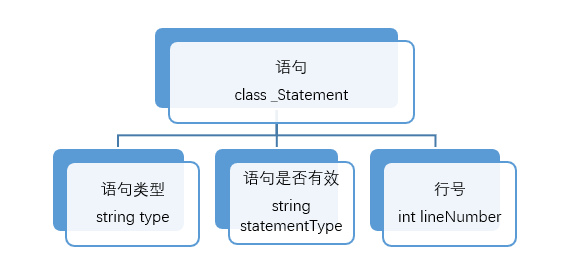
由于语句的种类很多，具有不同的语义和功能，不难想到利用C++继承、多态的性质进行数据结构的定义。

首先，定义语句的纯虚类：class Statement。随后下面对不同的子类进行展开设计。

```c++
1.	class _Statement{  
2.	    string type;
3.	    //"compound","repeat","while","for","if","assign","procedure" 
4.	    string statementType; ////区别于type，取值为"void"或"error"
5.	    int lineNumber;//行号
6.	}  
```

- 赋值语句(class _AssignStatement)
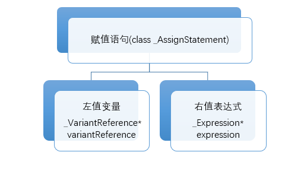
```c++
5.	class _AssignStatement:public _Statement{  
6.	public:  
7.	    _VariantReference* variantReference;  //左值变量
8.	    _Expression* expression; //右值表达式
9.	};
```

- if语句(class _IfStatement)
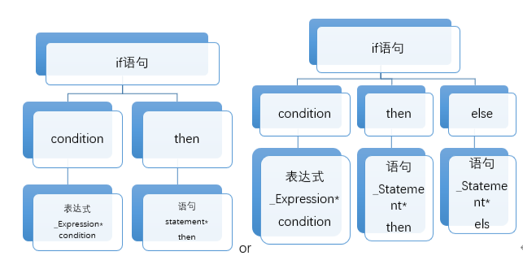
当els指针为NULL时，对应上图左边的结构；当els指针指向了一个语句结构时，对应上图右边的结构。
```c++
10.	class _IfStatetement:public _Statement{  
11.	public:  
12.	    _Expression* condition;  //条件表达式
13.	    _Statement* then; //满足条件时执行的语句
14.	    _Statement* els; //不满足条件时执行的语句，如果为NULL则没有else部分
15.	};  
```

- for语句(class _ForStatement)
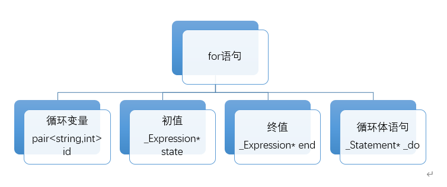
```c++
1.	class _Forstate:public _Statement{  
2.	public:  
3.	    pair<string,int> id;  //循环变量
4.	    _Expression* state;  //起始值
5.	    _Expression* end;  //终值
6.	    _Statement* _do; //循环体语句
7.	};  
```

- while语句(class _WhileStatement)
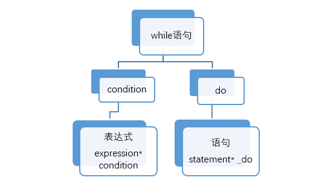
```c++
1.	class _WhileStatement:public _Statement{    
2.	public:    
3.	    Expression* condition;   //条件表达式
4.	    Statement* _do;   //循环体语句
5.	};  
```

- repeat语句(class _Repeatstate)
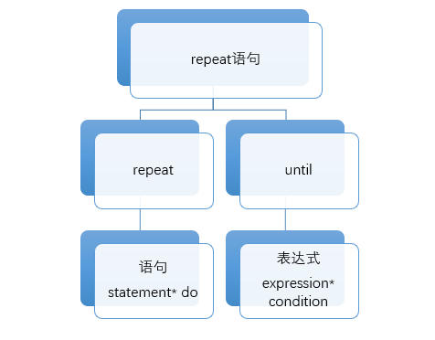
```c++
1.	class _WhileStatement:public _Statement{    
2.	public:    
3.	    Expression* condition;   //条件表达式
4.	    Statement* _do;   //循环体语句
5.	};  
```

- 复合语句(class _Compound)
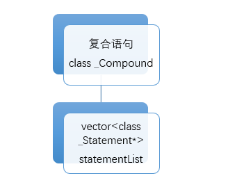
```c++
1.	class _Compound:public _Statement{  
2.	public:  
3.	    vector<class _Statement*>statements; //语句列表
4.	};  
```

- 过程调用语句(class _Procudure_call)
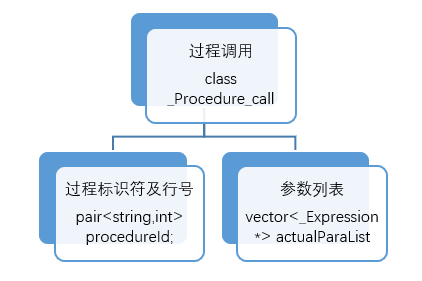
```c++
16.	class _procedureCall:public _Statement{
17.	    pair<string,int> procedureId; //过程标识符及行号
18.	    vector<_Expression*> actualParaList; //实参
19.	}
```

- 表达式(class _Expression)
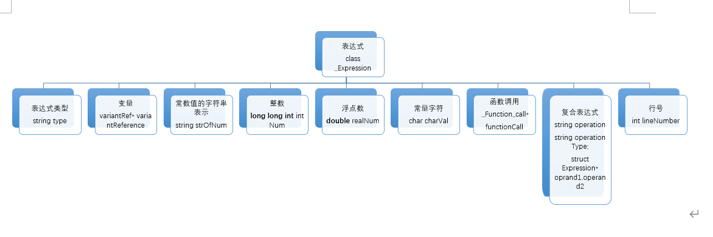
```c++
1.	class _Expression{    
2.	    string type;//表达式类型,"var"表示变量,"int"表示整数,"real"表示浮点数,"function"表示函数调用,"compound"表示复合表达式,compound有普通的二目运算符，还有minus、not、bracket等单目运算符  
3.	      
4.	    variantRef* variantReference;//变量   
5.	       
6.	    int intNum;//整数  
7.	      
8.	    float realNum;//浮点数  
9.	       
10.	    string strOfNum;//常数值的字符串表示
11.	      
12.	    char charVal; //常量字符
13.	    _FunctionCall *functionCall;//函数调用  
14.	      
15.	    string operation;//复合表达式  
16.	    string operationType;//操作符类型,"relop","mulop","addop","single"
17.	    _Expression *operand1,*operand2;  
18.	  
19.	    int lineNumber;//行数  
20.	}expression;   
```

#### 符号表
- 主符号表结构
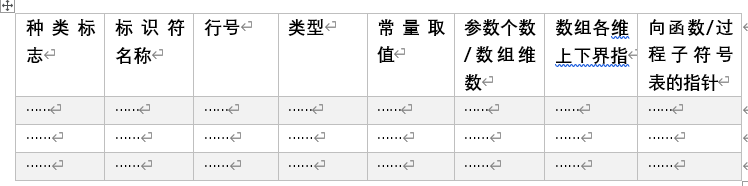
- 子符号表结构
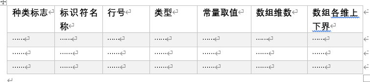
- 伪代码
```
// 主符号表
{
	线性表(主符号表表项)
}

// 主符号表表项
{
	符号种类 //"normal variant"表示普通变量,"constant"表示常量,"array"表示数组
//"procedure"表示过程,"function"表示函数标识符名称
	标识符名称
行号
	类型 //如果是变量/常量，则表示变量/常量类型；
//如果是数组，则表示数组元素的类型；
//如果是函数，则表示函数返回值类型，类型本身只能为基本类型
	常量取值
	数组维数/参数个数 //如果是数组，则表示数组维数，如果是函数/过程，则表示参数个数
	数组各维上下界
	指向过程/函数子符号表的指针
}

// 子符号表
{
	线性表(子符号表表项)
}

// 子符号表表项
{
	符号种类 //"value parameter"表示传值参数,"var parameter"表示传引用参数
//"normal variant"表示普通变量,"constant"表示常量,"array"表示数组
	标识符名称
行号
	类型 //如果是变量/常量，则表示变量/常量类型；
//如果是数组，则表示数组元素的类型； 
	常量取值
	数组维数 //表示数组维数
	数组各维上下界
}

```

### 模块之间的接口设计
模块之间的接口主要是一些函数和全局变量。
#### 词法分析和语法分析之间的接口
- yylval	结构体变量，用于保存记号的属性，在词法分析程序和语法分析程序之间共享记号信息
- int yylex();	调用词法分析器的接口，每调用一次，返回一个记号序列，其中记号本身为该函数的返回值，记号的属性保存在yylval结构体变量中；返回值为0表示词法分析程序停止运行

#### 语法分析与语义分析之间的接口
- class program *AST_Root	抽象语法树的根节点的指针

#### 语义分析和代码生成之间的接口
- class program *AST_Root	抽象语法树的根节点的指针
- class Symbol_Table *S_Table	主符号表的指针

#### 符号表操作接口
- 添加传值参数
    - 函数接口：`void addPara(string id, int lineNumber, string type);`
    - 参数列表：
        - string id	传值参数标识符
        - int lineNumber	行号
        - string type	传值参数类型
    - 返回值：无
- 添加引用参数
    - 函数接口：`void addVarPara(string id, int lineNumber, string type);`
    - 参数列表：
        - string id	引用参数标识符
        - int lineNumber	行号
        - string type	引用参数类型
    - 返回值：无
- 添加普通变量
    - 函数接口：`void addVar(string id, int lineNumber, string type);`
    - 参数列表：
        - string id	普通变量标识符
        - int lineNumber	行号
        - string type	普通变量类型
    - 返回值：无
- 添加常量
    - 函数接口：`void addConst(string id, int lineNumber, string type, bool isMinusShow, string value);`
    - 参数列表：
        - string id	常量标识符
        - int lineNumber	行号
        - string type	常量
        - bool isMinusShow	常量是否为负
        - string value	以字符串表示的常量取值
    - 返回值：无
- 添加数组
    - 函数接口：`void addArray(string id, int lineNumber, string type, int amount, vector< pair<int, int> > arrayRangeList);`
    - 参数列表：
        - string id	数组标识符
        - int lineNumber	行号
        - string type	数组元素类型
        - int amount	数组维数
        - vector< pair<int, int> > arrayRangeList	数组各维上下界列表
    - 返回值：无
- 添加过程
    - 函数接口：`void addProcedure(string id, int lineNumber, int amount, _SymbolTable *subSymbolTable=NULL);`
    - 参数列表：
        - string id	过程标识符
        - int lineNumber	行号
        - int amount	过程参数个数
        - _SymbolTable *subSymbolTable	指向子符号表的指针
    - 返回值：无
- 添加函数
    - 函数接口：`void addFunction(string id, int lineNumber, string type, int amount, _SymbolTable *subSymbolTable=NULL);`
    - 参数列表：
        - string id	函数标识符
        - int lineNumber	行号
        - string type	函数返回值类型
        - int amount	函数参数个数
        - _SymbolTable *subSymbolTable	指向子符号表的指针
    - 返回值：无
- 添加子符号表指针
    - 函数接口：`void addSubSymbolTable(string id, _SymbolTable *subSymbolTable);`
    - 参数列表：
        - string id	函数或过程标识符
        - _SymbolTable *subSymbolTable	指向子符号表的指针
    - 返回值：无
- 以标识符查找记录
    - 函数接口：`_SymbolRecord* findSymbolRecord(_SymbolTable* currentSymbolTable, string id, int mode=0);`
    - 参数列表：
        - _SymbolTable* currentSymbolTable	指向所需要查找的符号表的指针
        - string id	标识符
        - int mode	如果当前符号表没有找到，是否需要到上一级符号表查找，mode=0表示需要，mode!=0表示不需要
    - 返回值：_SymbolRecord*，指向所找到的记录类型的指针，如果没有找到，则为NULL

## 详细设计
见docx

## 测试
见docx
